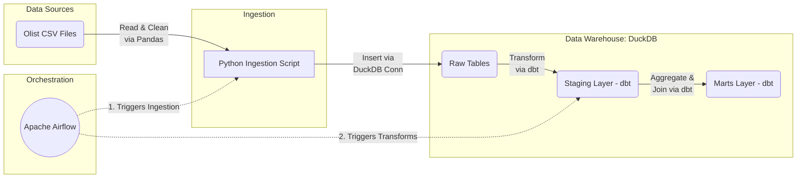
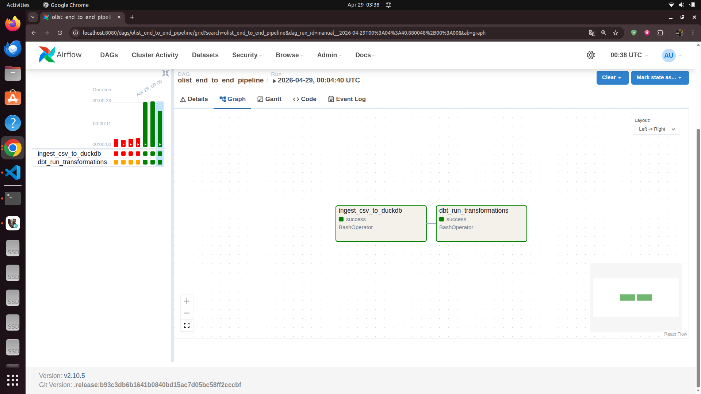
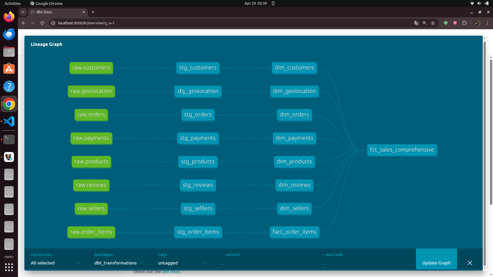
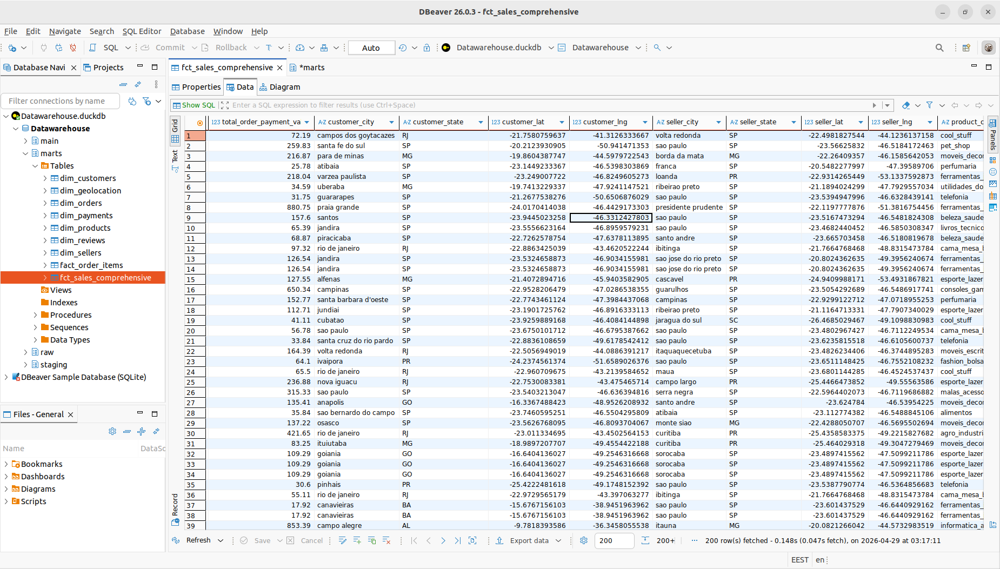
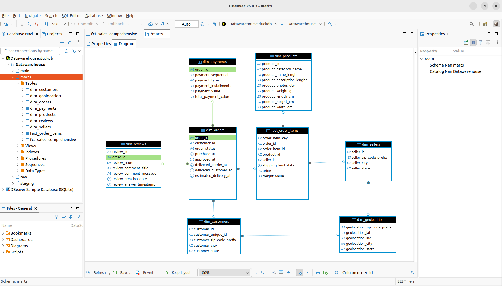

# Olist E-Commerce ELT Pipeline

An end-to-end ELT (Extract, Load, Transform) data pipeline leveraging the Brazilian E-Commerce Public Dataset by Olist. This project implements a **Modern Data Stack** architecture designed for efficiency through **Incremental Loading** patterns.

## Project Overview

This project simulates a production-ready data ecosystem localized on a single machine. It demonstrates advanced data engineering patterns:
- **Incremental Ingestion**: State-aware Python scripts that query the warehouse for existing timestamps and only fetch "Delta" records from source CSVs.
- **Efficient Transformation**: dbt models utilizing `incremental` materialization to merge new data into existing marts without full warehouse rebuilds.
- **Reliable Orchestration**: Apache Airflow DAGs managing idempotent task execution and job dependencies.

## Key Features

- **State Management**: The pipeline tracks the `MAX(order_purchase_timestamp)` to avoid redundant data processing and minimize I/O overhead.
- **Atomic Operations**: Ensuring tasks either fail completely or succeed, preventing partial data loads and maintaining warehouse integrity.
- **Star Schema Architecture**: A highly optimized dimensional model designed to empower BI tools and complex analytical queries.

## Architecture

The pipeline follows an ELT architecture, with DuckDB serving as the core engine.


## Setup Instructions

### 1. Environment Setup
To isolate the project's dependencies, create and activate a Python virtual environment, then install the necessary packages.

```bash
# Create the virtual environment
python3 -m venv .venv

# Activate the virtual environment
source .venv/bin/activate

# Install the required packages
pip install -r requirements.txt
```

### 2. Configure dbt Profile
Ensure your `~/.dbt/profiles.yml` is configured to target DuckDB for this project. Use the `ecommerce_platform` profile layout out below:

```yaml
ecommerce_platform:
  outputs:
    dev:
      type: duckdb
      # Update path to point to your local DuckDB database file
      path: {YOUR_DUCKDB_PATH} 
      threads: 4
  target: dev
```

## Orchestration & Pipeline Details

### DAG: `olist_end_to_end_pipeline`
The core Airflow DAG (`dags/olist_end_to_end_pipeline.py`) manages the end-to-end data build process. It consists of two primary tasks:
1. **`ingest_csv_to_duckdb`** (BashOperator): Executes the Python ingestion application (`ingestion/main.py`) to systematically parse, clean, and load new data into DuckDB.
2. **`dbt_run_transformations`** (BashOperator): Initiates the dbt build process (`dbt run`). It pulls the staging tables, applies SQL transformations, and materializes downstream data models.

*Execution Flow*: `ingest_csv_to_duckdb` >> `dbt_run_transformations`

### Pipeline Orchestration
> **Proof of Work:** Airflow DAG execution confirming successful end-to-end task chaining and successes.


## Data Model

The final dbt schema conforms to a Star Schema architecture designed to empower BI tools and reporting services.

### Core Fact Tables
- **`fct_sales_comprehensive`**: The unified fact table aggregating comprehensive metrics for orders, payment, freight, and geolocation metrics per sale.
- **`fact_order_items`**: A granular fact table capturing line-item level details of order transactions.

### Key Dimension Tables
- **`dim_products`**: Core dimensions (category, sizes) describing purchased goods.
- **`dim_customers`**: Dimensional reference for user context and demographics.
- **`dim_sellers`**: Metrics specific to the seller listing the products.
- **`dim_geolocation`**: Geographic location entities across Brazil (zip code, city, state).
- **`dim_orders`**: Order-level statuses, approval, and shipment delivery timestamps.
- **`dim_payments`**: Represents order transaction methods (Credit Card, Boleto) and sequences.
- **`dim_reviews`**: Review-level scoring and commentary tied to customer satisfaction.

### Data Lineage
> **Proof of Work:** dbt lineage graph demonstrating the seamless transformation dependencies flowing from `stg_orders` and other staging models directly into the `fct_sales_comprehensive` mart.


### The Resulting Data
> **Proof of Work:** A direct query preview of the `fct_sales_comprehensive` table securely functioning inside DuckDB, observed utilizing DBeaver or an identical database explorer.


### Database ER Diagram
> **Proof of Work:** An Entity-Relationship (ER) diagram generated from DBeaver showing the relationships between the tables in your data warehouse.

